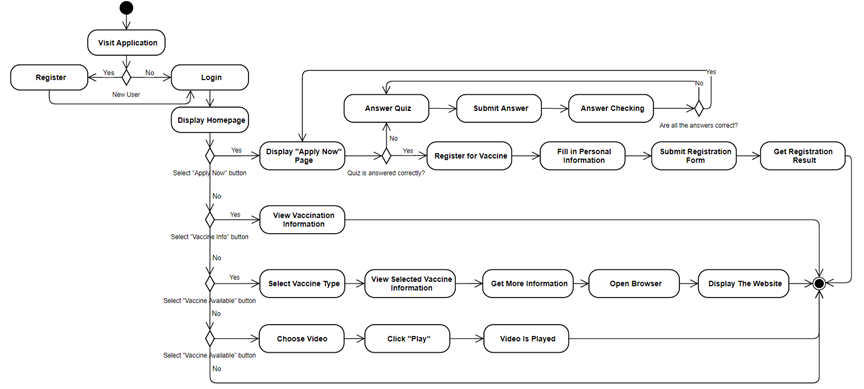
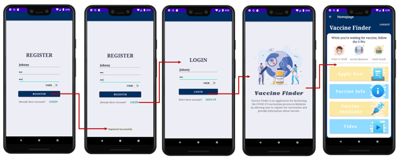
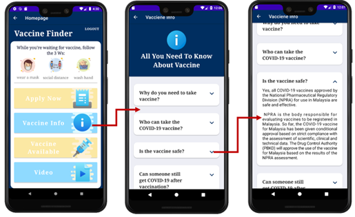
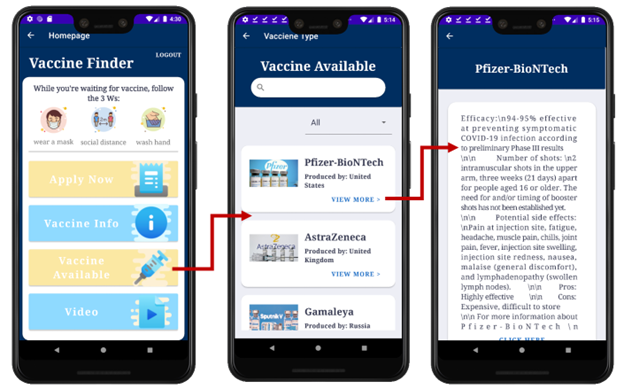

<h1 align="center" id="title">Vaccine Finder</h1>

Vaccine Finder is a vaccination application designed to facilitate the COVID-19 vaccination process. This app provides information about different types of vaccines their facts safety side-effects and eligibility criteria for vaccination. Users can complete a quiz to ensure a comprehensive understanding of the risks and side-effects of vaccination and register for vaccination after successfully answering the quiz questions.

## Table of Contents

<!-- - [🚀 Demo](#demo) -->
- [Tech Stack](#tech-stack)
- [Features](#features)
- [Activity Diagram](#activity-diagram)
- [Project Screenshots](#project-screenshots)

<!-- <h2>🚀 Demo</h2>

[https://res.cloudinary.com/dj90bmvon/image/upload/c\_padb\_auto:predominantfl\_preserve\_transparency/v1692502257/1\_Flow\_of\_User\_Login\_and\_Register\_wbl5yr.jpg?\_s=public-apps](https://res.cloudinary.com/dj90bmvon/image/upload/c_padb_auto:predominantfl_preserve_transparency/v1692502257/1_Flow_of_User_Login_and_Register_wbl5yr.jpg?_s=public-apps) -->

## Tech Stack

- Android Studio: Primary development tool
- Java: Server-side logic
- XML: UI layout
- Marvel App: Prototyping

## Features

### 1. User Authentication
- Users and admins can register for new accounts and log into the application.

### 2. Vaccine Information
- Users can access detailed information about different types of vaccines, including facts, safety, side-effects, and eligibility criteria for vaccination.

### 3. Comprehensive Quiz
- Users are required to complete a quiz to demonstrate a thorough understanding of the risks and side-effects of vaccination.

### 4. Vaccine Registration
- Users who successfully complete the quiz can register for vaccination.

### 5. Admin Functionality
- Admins have special privileges to:
  - Add new vaccines to the database.
  - Edit existing vaccine information.
  - Delete vaccines from the database.

## Activity Diagram

## Project Screenshots

1. Flow of User Login and Register

2. Flow for Getting Information about Vaccination

3. Flow for Getting the Available Vaccine in Malaysia

  

  